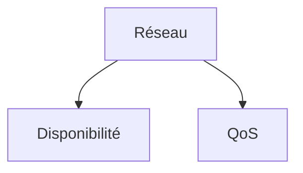

# CCNA2
## VLANs
### Fonctionnement de la découverte d'adresses
Le switch envoie une trame a tout ses ports ils renvoient une trame le switch associe chaque mac à un periférique c'est la table mac. Le client lui possède une table arp qui associe les MACS aux IP.

### Pilier du réseaux

### Cut and through

1). Reads the first bits from the trame to save the distination MAC, then he sends it immidiately. It's fast
2). Reads the whole trame and stores it to read the checksum. If it's correct it sends it if te checksum is incorrect it drops the trame. It's slower but realeses corrupted packets from the router.

### Switch Managing Vlan
SVI Switch Virtual Interface*

### VLAN 1 
On sort tout les ports du vlan 1 meme les non utilisés.

### Trunk
Port configurer pour laisser tout les vlans passer.

  
